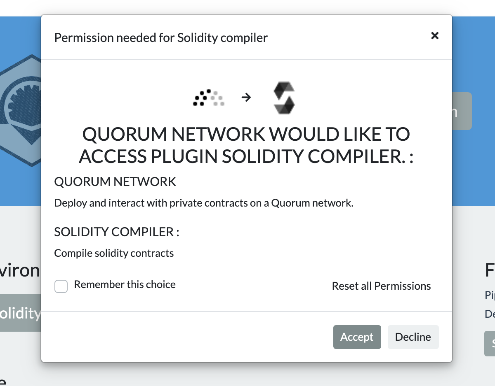
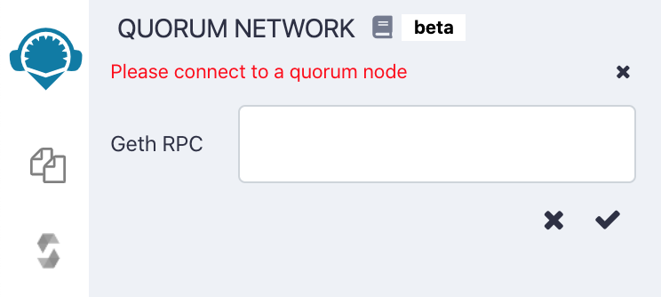
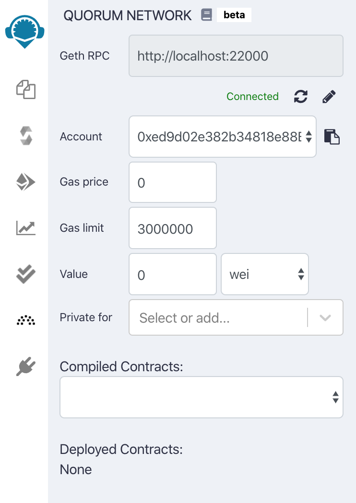
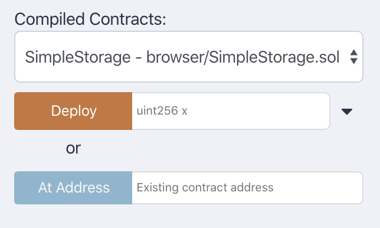
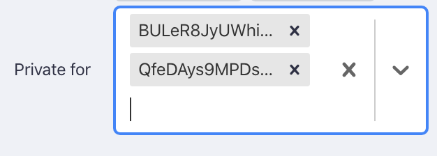
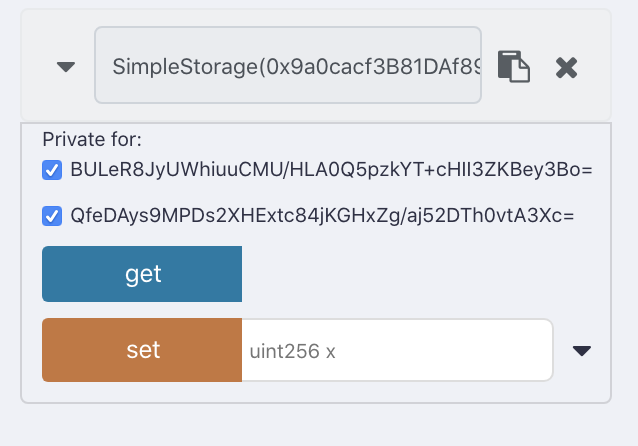

# Quorum Plugin for Remix
The Quorum plugin for Ethereum’s Remix IDE adds support for creating and interacting with private contracts on a Quorum network.

Getting Started with the Quorum Plugin for Remix
=================================================

1.  Go to the [Remix IDE](https://remix.ethereum.org/), click on the
    Plugins tab, scroll down to **Quorum Network**, and Activate.

    

2.  Accept the permission to allow the plugin to retrieve compilation
    results. This allows our plugin to use the solidity compiler to get
    the compiled contract binary to deploy to your Quorum node.

    

3.  The plugin should now be included in the icons on the left side.
    Click on the Quorum icon to show the plugin.

    

4.  Input the Geth RPC url and hit enter. If you are currently running
    the quorum-examples 7nodes network, the first node’s url is
    [http://localhost:22000](http://localhost:22000/)

    

5.  If the node is running, the plugin should now say Connected and the
    rest of the UI will have appeared.

    

6.  The Quorum plugin uses results from Remix’s Solidity compiler, so
    pull up some contract code and compile it like you normally would in
    Remix. The plugin will automatically receive the compiled code on
    each new compilation.

7.  Once you have a contract compiled, it will automatically be selected
    in the Compiled Contracts dropdown. Input any constructor values and
    deploy.

    

8.  If successful, the contract will show up in a collapsed view under
    ‘Deployed Contracts’. Click the caret to expand.

    

9.  From here you can call methods on the contract.

    

10. To create a private contract, add your Tessera public keys one at a
    time to the Private For multi-select box. Press enter after
    inputting each one to save and select.

    

11. Add as many peers as you want, then deploy the contract again like
    you did in step 7.

    

12. After deploying and expanding the new contract, you should see the
    public keys that you selected in the widget. Every method call will
    include the selected keys automatically.

    
